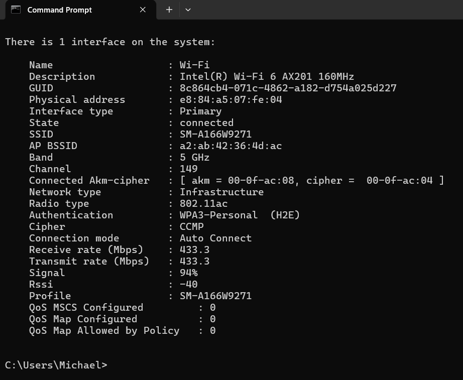
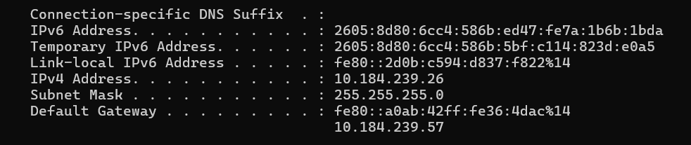
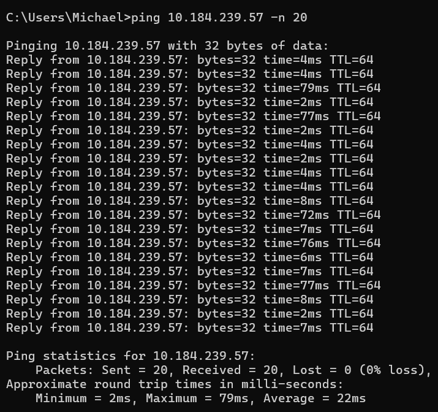
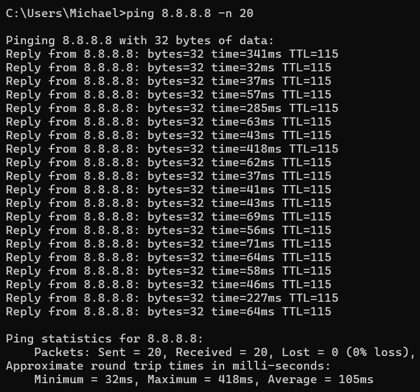
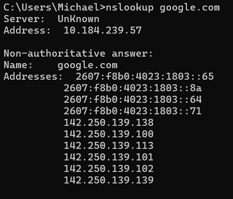
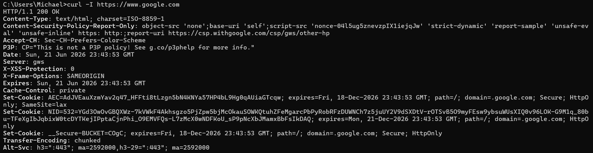
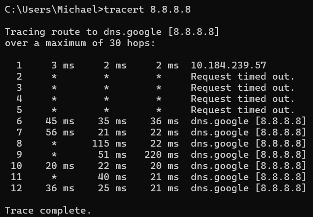

# Mobile Hotspot Connectivity Troubleshooting
## Objective

Troubleshoot slow browsing and delayed web loading on a Lenovo ThinkPad T15 using a Samsung phone hotspot on Rogers mobile data. Determine whether the issue is caused by laptop hardware, Wi-Fi hotspot connection, DNS, browser performance, or the cellular network path. Troubleshooting was performed using a structured approach, beginning with local connectivity validation before progressing through gateway, internet, DNS, and application-layer testing.

## Environment

* Device: Lenovo ThinkPad T15
* Wi-Fi Adapter: Intel Wi-Fi 6 AX201 160MHz
* Phone Hotspot: Samsung Mobile Hotspot
* Carrier: Rogers
* Hotspot Band: 5 GHz
* Security: WPA3-Personal

## Tools Used

* netsh
* ipconfig
* ping
* nslookup
* curl
* tracert
* Task Manager
* Browser testing

## Step 1 – Verify Wi-Fi Adapter and Hotspot Connection

Command:

```cmd
netsh wlan show interfaces
```
Screenshot:



Key Results:

```text
Band: 5 GHz
Radio Type: 802.11ac
Authentication: WPA3-Personal (H2E)
Receive Rate: 433.3 Mbps
Transmit Rate: 433.3 Mbps
Signal: 94%
RSSI: -40 dBm
```

Conclusion:

The laptop was successfully connected to the mobile hotspot over a 5 GHz wireless connection using WPA3-Personal security. Signal strength was excellent at 94% with an RSSI of -40 dBm, and the negotiated transmit and receive rates of 433.3 Mbps indicated that the wireless link was operating normally. No evidence of a local Wi-Fi connectivity issue was observed.

## Step 2 – Identify the Hotspot Gateway

Command:

```cmd
ipconfig
```
Screenshot:



Key Results:

```text
IPv4 Address: 10.184.239.26
Subnet Mask: 255.255.255.0
Default Gateway (IPv6): fe80::a0ab:42ff:fe36:4dac%14
Default Gateway (IPv4): 10.184.239.57
```

Conclusion:

The laptop successfully obtained a valid IPv4 address from the mobile hotspot and was assigned both IPv4 and IPv6 default gateways. This confirmed that DHCP was functioning correctly and that the hotspot was providing network connectivity to the laptop.

## Step 3 – Test Local Connectivity to the Phone

Command:

```cmd
```cmd
ping 10.184.239.57 -n 20
```
Screenshot:



Key Results:

```text
Packets Sent: 20
Packets Received: 20
Packet Loss: 0%
Minimum Latency: 2 ms
Maximum Latency: 79 ms
Average Latency: 22 ms

```

Conclusion:

The laptop successfully communicated with the hotspot gateway with 0% packet loss. Latency was generally low, although occasional spikes were observed. Overall, local connectivity between the laptop and phone hotspot was stable and functional.


## Step 4 – Test Internet Latency

Command:

```cmd
ping 8.8.8.8 -n 20
```
Screenshot:



Key Results:

```text
Packets Sent: 20
Packets Received: 20
Packet Loss: 0%
Minimum Latency: 32 ms
Maximum Latency: 418 ms
Average Latency: 105 ms
```

Conclusion:

The laptop successfully reached an external internet host with 0% packet loss. However, latency was significantly higher and more variable than the gateway test. While the minimum latency was 32 ms, spikes as high as 418 ms were observed, resulting in an average latency of 105 ms. These results suggested that the issue was occurring beyond the local Wi-Fi connection and hotspot gateway.

## Step 5 – Test DNS Resolution

Command:

```cmd
nslookup google.com
```
Screenshot:



Key Results:

```text
DNS Server: 10.184.239.57
Hostname Resolved: google.com

IPv4 Addresses Returned:
142.250.139.138
142.250.139.100
142.250.139.113
142.250.139.101
142.250.139.102
142.250.139.139

IPv6 Addresses Returned:
2607:f8b0:4023:1803::65
2607:f8b0:4023:1803::8a
2607:f8b0:4023:1803::64
2607:f8b0:4023:1803::71
```

Conclusion:

DNS resolution was successful. The hotspot DNS server responded correctly and resolved google.com to multiple IPv4 and IPv6 addresses. This confirmed that DNS services were functioning properly and were not contributing to the connectivity issue.

## Step 6 – Test HTTP Connectivity

Command:

```cmd
curl -I https://www.google.com
```
Screenshot:



Key Results:

```text
HTTP Response: HTTP/1.1 200 OK
Server: gws
Content-Type: text/html; charset=ISO-8859-1
Connection Established: Successful
```

Conclusion:

The laptop successfully established an HTTPS connection to Google's web server and received a valid HTTP 200 OK response. This confirmed that web traffic was functioning correctly and that the issue was not caused by a complete loss of internet connectivity or a web access failure.

## Step 7 – Test Real-World Application Performance

Observations:

Google Search loaded normally.

YouTube videos loaded successfully but startup times were noticeably slower than expected.

Seeking forward or backward within videos introduced delays before playback resumed.

General web browsing was functional, but some websites appeared slower than expected during testing.


Conclusion:

Application-level testing confirmed that internet access was functional, but performance was inconsistent.

The issue was most noticeable when accessing content-heavy services such as YouTube.

These findings aligned with the elevated latency and latency spikes observed during internet connectivity testing.


## Step 8 – Trace the Network Path

Command:

```cmd
tracert 8.8.8.8
```

Screenshot:



Key Results:

```text
Destination: 8.8.8.8 (Google DNS)

Hop 1: 10.184.239.57
Latency: 2-3 ms

Hops 2-5:
Request timed out

Subsequent hops:
Latency generally ranged between 20 ms and 56 ms, with occasional spikes up to 220 ms.

Trace completed.
```

Conclusion:

The traceroute successfully reached Google's public DNS server. The first hop responded with very low latency, confirming that the local hotspot connection was healthy. Several intermediate hops did not respond to traceroute requests, which is common on carrier and backbone networks that deprioritize or block ICMP traceroute traffic. Despite these timeouts, the trace completed successfully, indicating that traffic was reaching its destination. Occasional latency spikes observed during the trace were consistent with the elevated latency identified during earlier internet connectivity testing.

## Step 9 – Compare LTE vs 5G

LTE Results:

```text
Minimum = 40ms
Maximum = 76ms
Average = 53ms
Packet loss = 0%
```

5G Results:

```text
Minimum = 36ms
Maximum = 194ms
Average = 64ms
Packet loss = 0%
```

Conclusion:

Both LTE and 5G provided successful internet connectivity with no packet loss. LTE produced more consistent latency, while 5G exhibited larger latency spikes despite having a similar minimum response time. Reconnecting and retesting improved performance, suggesting that the issue was related to the cellular network path rather than the laptop, Wi-Fi adapter, or hotspot configuration.

## Final Diagnosis

The Lenovo ThinkPad T15 was not identified as the source of the connectivity issue.

### Ruled Out

* SSD performance issues
* CPU performance issues
* Memory (RAM) limitations
* Wi-Fi adapter faults
* Weak hotspot signal
* WPA3 wireless configuration issues
* DHCP configuration issues
* DNS resolution failures
* General internet connectivity failures

### Most Likely Cause

Testing indicated that the issue was occurring beyond the laptop and local hotspot connection. Elevated latency, latency spikes, and inconsistent application performance pointed to instability within the cellular network path.

As part of troubleshooting, the phone was switched from 5G to LTE and later returned to 5G. The hotspot connection was also effectively re-established during this process. Reconnecting required the phone to disconnect from the cellular network, re-register with the carrier, establish a new data session, and potentially connect through a different tower, sector, frequency band, or carrier routing path.

The exact network change could not be determined; however, performance improved following these actions. This suggested that the issue was related to the mobile network connection, carrier routing, or cellular network conditions rather than a fault with the laptop hardware, Wi-Fi adapter, or operating system.

## Recommended Fixes

1. Use LTE when it provides lower and more stable latency than 5G.
2. Toggle airplane mode or reconnect the hotspot to establish a new cellular session.
3. Perform ping testing during periods of poor performance to identify latency spikes.
4. Compare performance from different physical locations and cellular coverage areas.

## Skills Demonstrated

* Structured network troubleshooting
* Wireless LAN diagnostics
* IP configuration verification
* Gateway identification and testing
* Latency and jitter analysis
* DNS troubleshooting
* HTTP connectivity testing
* Route tracing (tracert)
* WAN versus LAN fault isolation
* Evidence-based troubleshooting and documentation
